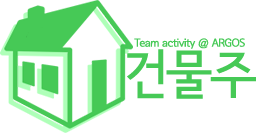

2021학년도 충남대학교 보안동아리 ARGOS 팀 활동 "건물주" 에서 사용될 교육자료가 저장될 레포지토리입니다. 질문 사항은 이슈트래커에 남겨주시면 됩니다.

## 커리큘럼
* HTTP의 기본 동작, PHP 기초

  웹 프로그램이 동작하기 위해 필요한 프로토콜인 HTTP에 대한 이해와 동적 웹 애플리케이션을 위한 서버사이드 언어인 PHP에 대해 이해해봅니다. 이번 활동에서는 최신 버전인 PHP 8을 사용하며 JetBrains PHPStorm을 이용하여 개발 환경을 세팅합니다.
  
* Form과 Method, Header

  백엔드 프로그램으로 값을 전달하는 방법에 대해 알아봅니다. HTML에서 사용하는 Form과 Input 요소들, 각 HTTP Method의 의미, Request Header, Response Header에 들어있는 각 값들의 의미를 이해합니다.
  
* 쿠키와 세션

  브라우저와 PHP 프로그램이 어떻게 서로를 알아보는지에 대해 알아봅니다. 쿠키와 세션이 서로 어떤 관계에 있으며 이 두 기능의 차이가 무엇인지 이해해봅니다. 그리고 이해한 내용을 바탕으로 간단한 로그인 프로그램을 구현하여봅니다.

* DBMS와 SQL

  대부분의 현대 웹 프로그램의 영속성을 담당하는 DBMS(Database Management System)와 DBMS에서 데이터를 처리하기 위한 언어인 SQL에 대해 간단하게 알아봅니다. 본 활동에서는 무료이면서 쉽게 입문 가능한 MariaDB를 이용하여 진행합니다. SQL에 대해 어느정도 이해되었다면 사용자의 정보를 담는 스키마를 직접 설계해보고, 이에 대한 DDL(Data Definition Language)을 작성해봅니다.
  
* SQL Injection과 Prepared Statement

  신뢰되지 않는 입력을 제대로 필터링 하지 않고 쿼리에 직접 집어넣을 경우 어떤 일이 벌어질 수 있는지 알아봅니다. 그리고 이러한 공격에 직접적이면서도 근본적인 방어책인 Prepared Statement에 대해 알아봅니다. 이전 회차에서 만들어 두었던 로그인 프로그램을 확장하여 DB와 연동되도록 수정해봅니다.
  
* 게시판과 CRUD 설계하기

  게시판 프로그램에 대한 이해와 앞으로 만들게 될 게시판 프로그램의 기능에 대해 자세히 알아봅니다. 해당 기능들을 사용자의 입장이 아닌 개발자의 입장에서 어떻게 만들어야 할지 고민해보고 게시판에 필요한 스키마(글, 댓글, 파일 등)를 직접 설계해 보도록 하며, 이것을 DDL로 옮겨보도록 합니다.
  
* Cross Site Scripting (XSS)

  게시판 프로그램은 작성하기에 따라 XSS 공격의 일종인 Stored XSS에 취약해질 수 있습니다. Stored XSS로부터 세션쿠키를 어떻게 지켜내고, 또 어떻게 무력화 시킬 수 있는지 간단하게 알아봅니다. 글 목록, 검색, 쓰기, 수정, 읽기 기능을 구현해봅니다.
  
* Cross Site Request Forgery (CSRF)

  폼 요청 자체를 검증하지 않을 경우 어떤 일이 벌어질 수 있는지에 대해 알아봅니다. 그리고 폼을 어떻게 검증할 수 있을지 이해해보며 댓글 목록, 쓰기, 수정, 삭제를 구현해봅니다.
  
* MIME Sniffing

  대부분의 게시판 프로그램은 파일 첨부 기능을 제공합니다. 그러나 사용자가 첨부하는 파일 또한 신뢰될 수 없으며 브라우저는 자체적으로 파일을 해석하는 기능을 가지고 있어 특정 공격에 취약하게 됩니다. 따라서 이러한 공격을 어떻게 막아낼 수 있는지, 게시판에서 파일을 어떻게 관리하는지 알아보고 여태까지 구현한 게시판 프로그램에 파일 첨부 기능을 추가해봅니다.
  
* 최종 코드리뷰 & 모의해킹

  완성된 게시판 프로그램의 소스코드를 서로 평가해보고 수정할 부분과 본받을 부분에 대해 서로 이야기 나누어 봅니다. 또한 각자 서로의 프로그램에 여태까지 배웠던 공격 기법들을 실제로 실행해보면서 혹시 빠뜨린 취약점이 있는지 찾아봅니다. 

## 학습에 도움이 많이 될 자료들
* [W3schools](https://www.w3schools.com/)
  
  건물주 팀은 백엔드 중심의 활동이지만 프론트에 대한 지식이 아주 조금은 필요하므로 (+ HTML, CSS, JavaScript에 대해 좀 더 알아보고 싶다면) 자주 이용해보시면 좋습니다! 더불어 PHP와 SQL에 관한 내용도 다루고 있으므로 꽤 많은 내용에 대해 공부해보실 수 있습니다.

* [PHP](https://www.php.net/)
  
  PHP를 주 언어로 사용하게 될 것이므로, 레퍼런스 확인을 위해 알아두시면 좋습니다.
